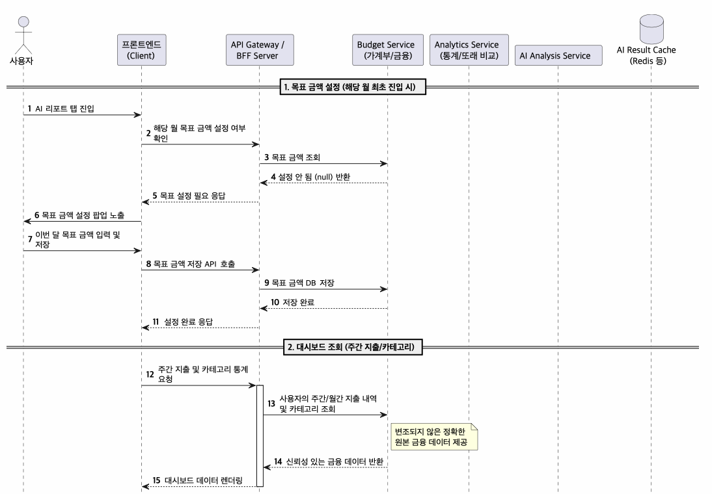
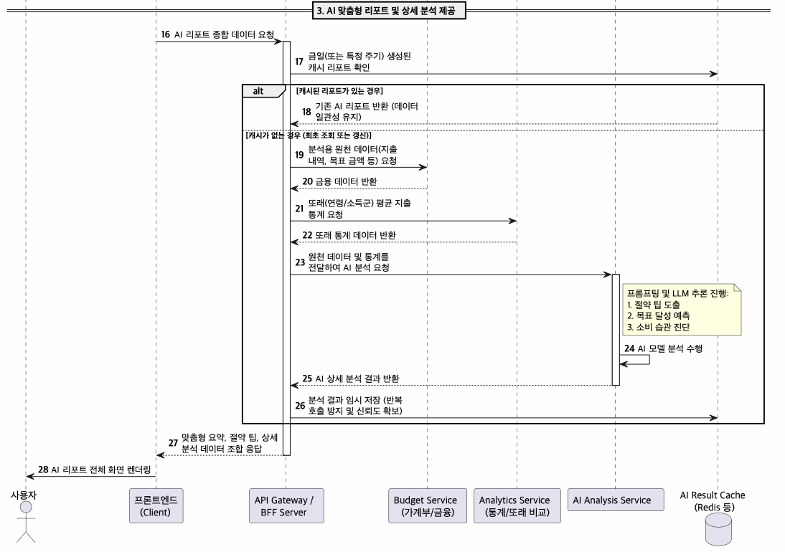
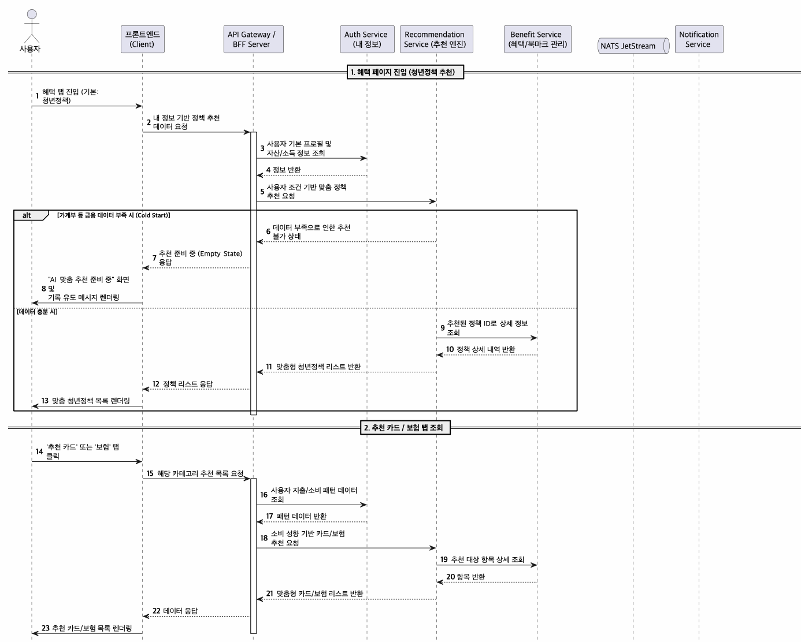
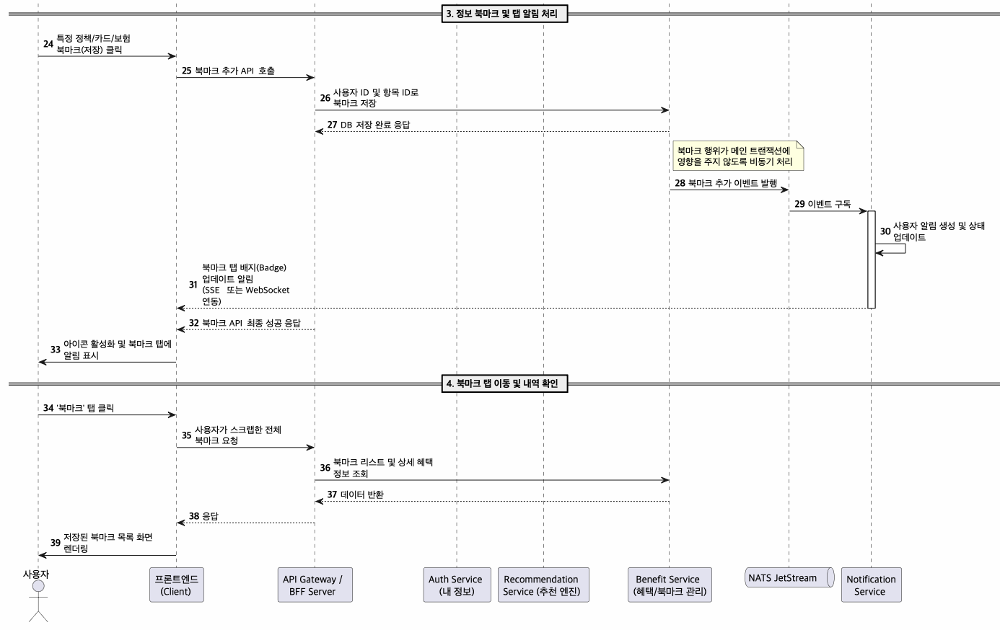
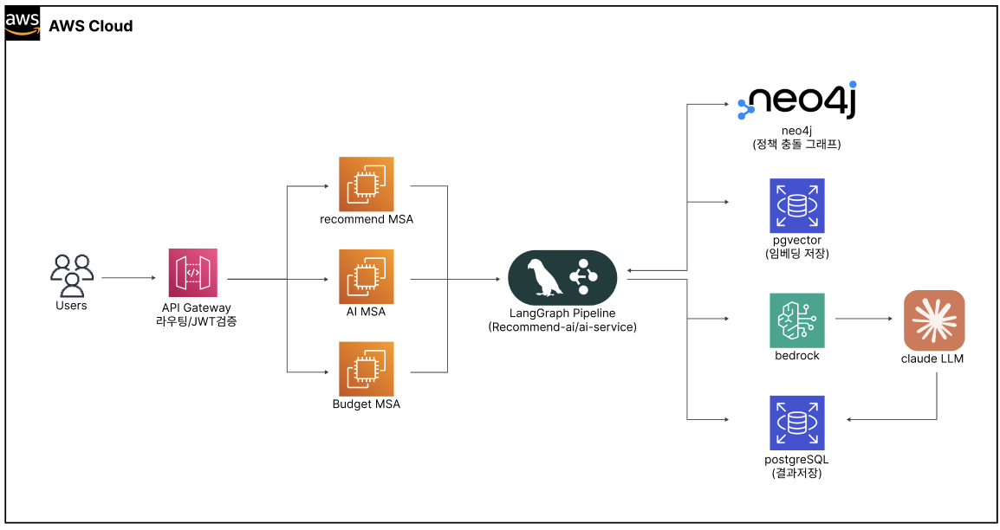
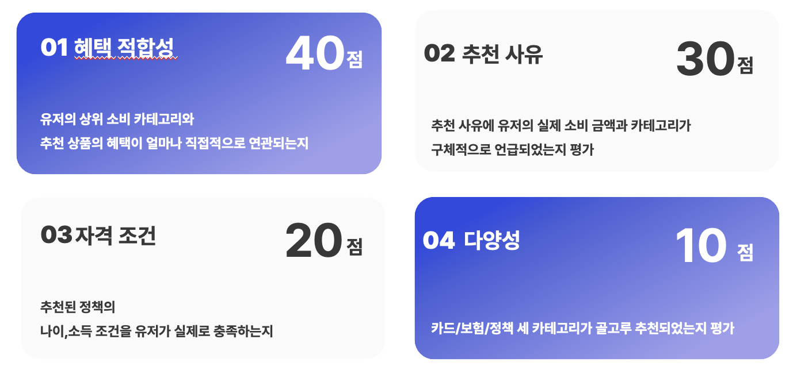
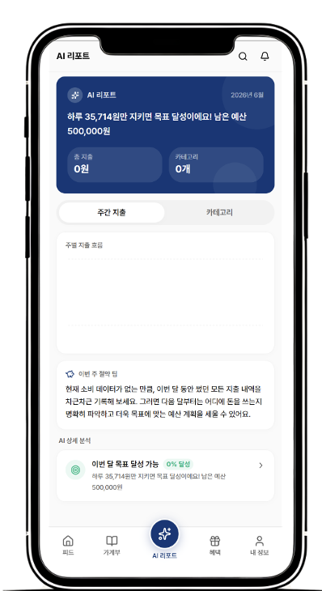
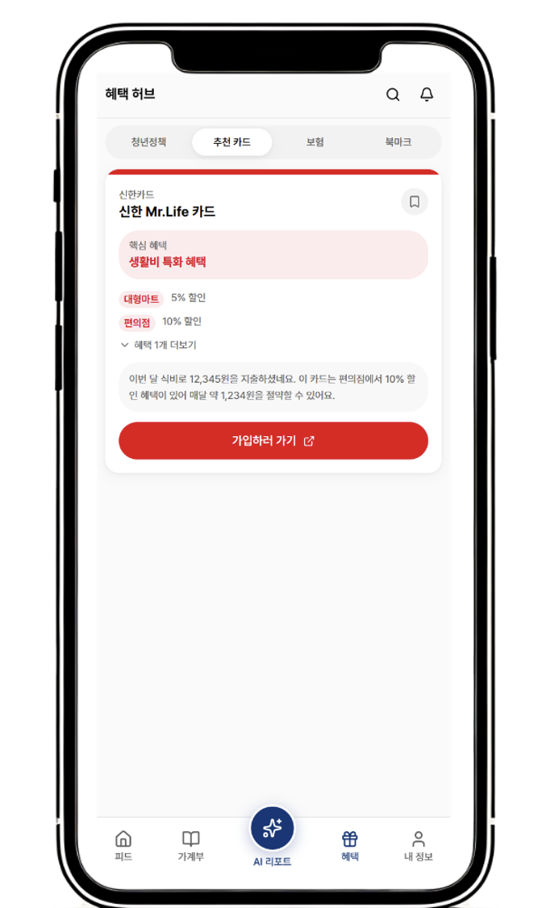
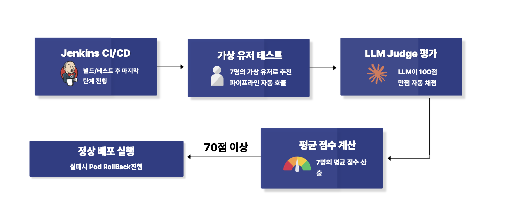
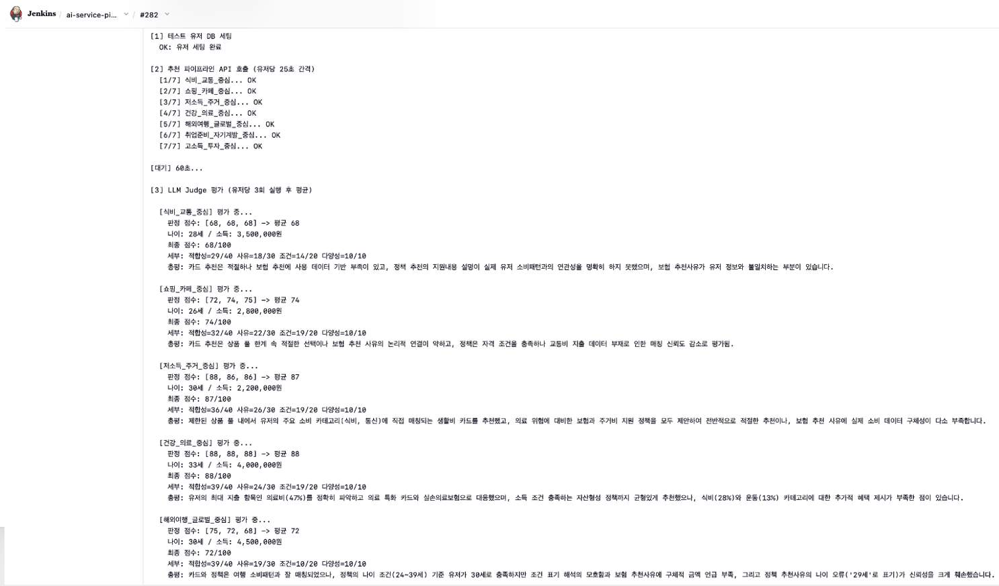

<div align="center">
  <h1>MoneyLog AI Service</h1>
  <p>
    <strong>청년 맞춤형 금융 생활 관리 플랫폼의 AI·추천 특화 마이크로서비스</strong>
  </p>
  <p>
    <!-- Badges -->
    
    
    
    
    
  </p>
</div>

---

## 소개

수집된 사용자 소비 데이터를 분석하여 **월별 리포트, 또래 비교, 맞춤형 금융 상품 및 청년 정책 추천**을 제공합니다. 
보기 힘든 숫자 나열 보단, AI가 소비 패턴을 분석하고 친근한 자연어로 전달하며, 사용자 조건에 맞는 혜택 정보를 자동으로 큐레이션합니다.

<div align="center">
  
  
</div>

<details>
<summary><b>목차 (Table of Contents)</b></summary>

- [주요 기능](#주요-기능)
- [기술 스택](#기술-스택)
- [아키텍처](#아키텍처)
- [AI 추천 파이프라인](#ai-추천-파이프라인)
- [프로젝트 구조](#프로젝트-구조)
- [API 명세](#api-명세)
- [CI/CD & LLM Judge](#cicd--llm-judge)
- [환경변수](#환경변수)
- [참고 자료](#참고-자료)
</details>

---

## 주요 기능

- **소비 패턴 분석**: 월별 지출 목표 달성 예측 및 과소비 경고 알고리즘
- **자연어 리포트 제공**: LLM(Claude Haiku)을 활용한 사용자 친화적 금융 리포트 생성
- **개인 맞춤형 추천**: 나이, 소득, 소비 카테고리를 반영한 혜택(카드/보험/청년정책) 큐레이션
- **그래프 & 벡터 융합 검색**: Neo4j 지식 그래프(상품 관계/정책 충돌 감지)와 pgvector 하이브리드 검색 기반 고정밀 추천

<div align="center">
  
  
  
</div>

---

## 기술 스택

### Backend & AI/ML
| 분류 | 기술 | 설명 |
|---|---|---|
| **Language** |  | AI/ML 생태계 최적, SDK 공식 지원 |
| **Framework** |  | 비동기 처리 및 자동 OpenAPI 문서화 |
| **LLM Orchestration** | **LangGraph** | 상태 기반 DAG 파이프라인, 노드별 독립 실행/에러 핸들링 |
| **AI Models** | **AWS Bedrock** | Claude Haiku (자연어 생성), Titan Embed V2 (256차원) |
| **Reranker** | **KLUE Cross-Encoder** | 한국어 특화 모델 기반 정교한 관련성 판단 |

### Database & Infrastructure
| 분류 | 기술 | 설명 |
|---|---|---|
| **Databases** | <br><br> | 메인 DB(pgvector 내장) / 정책간 충돌 감지 GraphDB / 세션 및 캐시 |
| **Infrastructure** | <br> | 쿠버네티스 컨테이너 오케스트레이션 및 서비스 메시 |
| **DevOps & CI/CD** | <br> | 온프레미스 에이전트 기반 배포, 정적 분석 및 품질 게이트 |
| **IaC & Tracing** | <br>**LangSmith** | AWS 인프라 코드 관리 및 LangGraph 파이프라인 디버깅 추적 |

---

## 아키텍처

<div align="center">
  
</div>

<details>
<summary><b>상세 데이터 플로우 보기</b></summary>

```text
[프론트엔드 (Next.js)]
        ↓
[API Gateway (Spring)]  →  X-User-Id 헤더 주입
        ↓
[AI Service (FastAPI)]
  ├── LangGraph 추천 파이프라인
  │     ├── pgvector (AWS RDS)
  │     ├── Neo4j AuraDB
  │     └── AWS Bedrock (Claude Haiku, Titan Embed)
  └── Redis Sentinel
```
> EKS → 온프레미스 연결은 WireGuard 터널(Bastion EC2 경유)을 통해 이루어집니다.
</details>

---

## AI 추천 파이프라인

LangGraph 기반 `profile → embed → vector_search → rerank → filter → graph_expand → conflict → llm → save` 순서로 실행됩니다.

1. **임베딩 최적화**: 단일 텍스트 대신 **카테고리별 가중 평균 임베딩** 적용 (유사도 정확도 0.19 → 0.35 향상) 및 차원 축소(1024D → 256D).
2. **그래프 확장 (Graph Expand)**: Neo4j에서 상품 관계 트리플(`IN_CATEGORY`, `TAGGED_WITH`, `SIMILAR_TO`)을 통해 벡터 검색의 한계 보완.
3. **충돌 감지 (Conflict)**: 중복 신청이 불가능한 청년 정책 쌍 감지.

<details>
<summary><b>Ablation Study (평가 지표 개선)</b></summary>

<br>

<div align="center">
  
  
</div>

| 단계 | 구성 | LLM Judge 점수 |
|---|---|:---:|
| Stage 1 | 벡터 검색만 | 55.1 |
| Stage 2 | + Neo4j Graph DB | 50.8 |
| Stage 3 | + Reranker | 60.2 |
| Stage 4 | + 소득조건 필터 | 66.6 |
| **현재** | **+ 지역필터, Reranker 타입분리, 보험위험도** | **72.9** |

</details>

---

## 프로젝트 구조

<details>
<summary><b>디렉토리 구조 펼쳐보기</b></summary>

```text
app/
├── main.py                          # FastAPI 앱 초기화, 라우터 등록
├── core/                            # 클라이언트 연동, 환경변수, 예외 처리
│   ├── client/                      # Bedrock, Neo4j, LLM 클라이언트
│   ├── config/                      # DB, Redis 등 연결 설정
│   └── error/                       # 전역 예외 핸들러
├── domain/                          # 핵심 비즈니스 로직
│   ├── recommend_ai/                # LangGraph AI 추천 파이프라인
│   ├── recommend/                   # 추천 결과 조회/북마크 API
│   ├── insight/                     # AI 리포트 생성 및 분석
│   ├── report/                      # 소비 데이터 관리
│   ├── profile/                     # 유저 프로필 관리
│   └── sync/                        # DB -> Neo4j 동기 동기화 배치
├── k8s/                             # EKS 배포 명세 (deployment, service)
├── Jenkinsfile                      # CI/CD 파이프라인 스크립트
└── llm_benchmark.py                 # LLM Judge CI 평가 스크립트
```
</details>

---

## API 명세

### AI Report & Insight

<div align="center">
  
</div>

| HTTP | Endpoint | 설명 |
|---|---|---|
| `GET` | `/api/ai/insights` | 주간 지출 BarChart, 카테고리 도넛차트, 과소비 경고 등 인사이트 4종 반환 |
| `GET` | `/api/ai/report/status` | AI 리포트 진입 상태 체크 (프로필/목표 필요 여부) |
| `POST` | `/api/ai/report/goal` | 이번 달 지출 목표 설정 |
| `GET` | `/api/ai/report/peers-comparison`| 또래 그룹(나이대/소득) 평균 소비 비교 데이터 반환 |

### AI Recommend

<div align="center">
  
</div>

| HTTP | Endpoint | 설명 |
|---|---|---|
| `GET` | `/api/recommend/cards` | AI 추천 카드 목록 (자연어 추천 사유 포함) |
| `GET` | `/api/recommend/insurances`| AI 추천 보험 목록 조회 |
| `GET` | `/api/recommend/policies` | AI 추천 청년 정책 목록 (D-day순) |
| `PATCH`| `/api/recommend/bookmark/patch`| 추천 혜택 북마크 토글 설정/해제 |

### Internal / 관리자 API

<details>
<summary><b>API Gateway 내부 전용 엔드포인트 보기</b></summary>

| HTTP | Endpoint | 설명 |
|---|---|---|
| `POST`| `/internal/recommend/generate/{user_id}`| 추천 파이프라인 수동 트리거 |
| `POST`| `/internal/recommend/embed/products` | 상품 임베딩 일괄 재생성 |
| `POST`| `/internal/recommend/sync/graph` | RDS → Neo4j 그래프 동기화 |
| `GET` | `/internal/recommend/graph/stats` | 그래프 노드/엣지 통계 조회 |
</details>

---

## CI/CD & LLM Judge

GitLab 커밋 시 Jenkins를 통해 `코드 검사(SonarQube) -> 빌드 -> EKS 배포`가 자동화되어 있습니다.

### LLM Judge 자동 검증
<div align="center">
  
  
</div>

배포 직후 추천 품질 저하를 막기 위해 **LLM-as-a-Judge** 파이프라인이 백그라운드에서 동작합니다.
- **평가 기준**: 혜택 적합성(40점), 추천 사유 품질(30점), 사용자 조건 충족(20점), 추천 다양성(10점)
- 통과 기준치(평균 70점) **미달 시 자동 `rollout undo`** 처리되어 안정성을 보장합니다.

---

## 환경변수

```env
# Database
DB_HOST=
DB_PORT=5432
DB_NAME=
DB_USER=
DB_PASSWORD=
DB_SSLMODE=require

# AWS
AWS_REGION=ap-northeast-2
AWS_ACCESS_KEY_ID=
AWS_SECRET_ACCESS_KEY=

# Neo4j
NEO4J_URI=
NEO4J_USER=neo4j
NEO4J_PASSWORD=

# Anthropic
ANTHROPIC_API_KEY=

# Redis
REDIS_SENTINEL_HOSTS=
REDIS_SENTINEL_MASTER=

# Auth
GATEWAY_SECRET_TOKEN=
```

---

## 참고 자료
- [FastAPI 공식 문서](https://fastapi.tiangolo.com)
- [LangGraph Documentation](https://langchain-ai.github.io/langgraph)
- [AWS Bedrock Titan Embeddings](https://docs.aws.amazon.com/bedrock/latest/userguide/titan-embedding-models.html)
- [pgvector GitHub](https://github.com/pgvector/pgvector)
- [Neo4j AuraDB](https://neo4j.com/docs/aura)
- [bongsoo/klue-cross-encoder-v1 (HuggingFace)](https://huggingface.co/bongsoo/klue-cross-encoder-v1)
- [SQLAlchemy 2.0 공식 문서](https://docs.sqlalchemy.org/en/20)
- [LangSmith 문서](https://docs.smith.langchain.com)